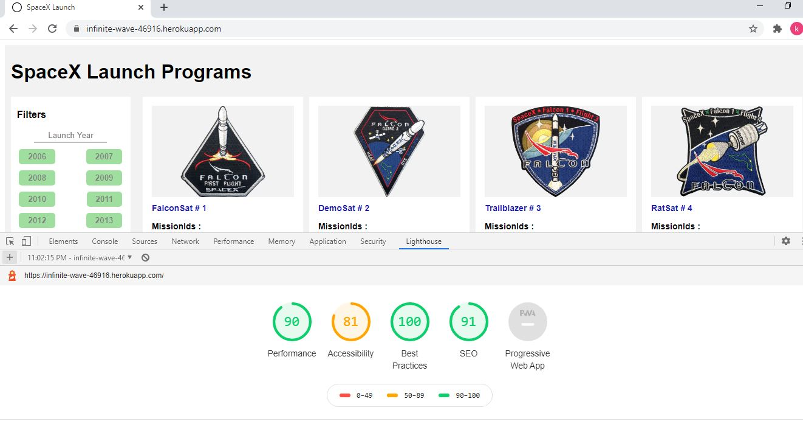

# Sapient

This project was developed Angular 11 version 

Desktop View

Ipad View

Mobile View

Year Filter

Successfully Land

Successfullylaunch

LightHouse Score

Karma Test Case

Heroku BuildLog
https://dashboard.heroku.com/apps/infinite-wave-46916/activity/builds/049d9ad1-40ae-4ab9-b8ca-7bd228dfd709

## Development server

we run our angular code in NodeJS plateform and we run in server side

We build and deployed our code in Heroku web server 

Web URL: https://infinite-wave-46916.herokuapp.com/

## Code scaffolding

Run `ng generate component component-name` to generate a new component. You can also use `ng generate directive|pipe|service|class|guard|interface|enum|module`.

## Build

Run `ng build` to build the project. The build artifacts will be stored in the `dist/` directory. Use the `--prod` flag for a production build.

## Running unit tests

Run `ng test` to execute the unit tests via [Karma](https://karma-runner.github.io).

## Running end-to-end tests

Run `ng e2e` to execute the end-to-end tests via [Protractor](http://www.protractortest.org/).

## Further help

To get more help on the Angular CLI use `ng help` or go check out the [Angular CLI Overview and Command Reference](https://angular.io/cli) page.
